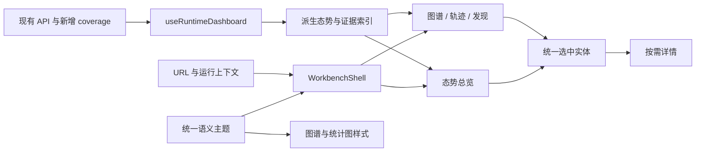

# 青玄 自动渗透agent：前端重构设计

日期：2026-09-15。源码基线：`d7da7e1`。

状态：设计文档完成，供实施前审阅。用户已选择深色安全指挥工作台，并明确产品名称与图片资源记录要求；其余细节为本文提出的具体方案，不代表已实现或已逐项确认。

本次使用 Superpowers 的 brainstorming 方法收敛需求、比较方向、定义边界并进行审阅。本文是设计规格；writing-plans 的逐任务实施计划应在设计审阅后另行编写。本轮不实现前端，也不生成图片。

## 1. 产品目标与品牌

产品完整名称为 **青玄 自动渗透agent**，导航与窄空间简称 **青玄**。中英文界面均保留“青玄”品牌；英文界面的功能描述可用 `Autonomous Pentest Agent`，不将旧项目名作为产品名。

青玄是基于既有代码演进的自动渗透工作台。主要用户是需要启动任务、观察自主执行、检查发现、判断证据和介入异常的操作人员。界面应让用户快速回答：

1. 当前针对什么目标，任务是否仍在推进？
2. 已发现哪些主机、服务、漏洞和有效利用证据？
3. 当前有哪些阻塞、失败或待审批事项？
4. 一个结论具体来自哪个节点、事件、产物或请求？

高级感以信息主次、稳定布局、精确排版和连贯操作体现。态势感由真实拓扑、执行变化和证据关联构成。

### 品牌替换边界

| 位置 | 设计要求 |
| --- | --- |
| `web/index.html` | 静态标题改为“青玄 自动渗透agent”，增加品牌 favicon |
| `web/src/language.tsx` | `app.title`、`auth.brand`、`auth.enterWorkbench` 等中英文品牌文案统一；动态标题使用“页面名称 · 青玄” |
| `AuthScreen.tsx`、`Sidebar.tsx` | 替换旧品牌文字和“鸾”标记，使用青玄品牌组件 |
| 新增总览、空状态与界面截图 | 使用青玄；原始任务内容与第三方材料保持原文；本期不新增报告封面生成能力 |
| 包名、Docker 镜像、运行目录、API 路径、Cookie 和存储 key | 本次不做全仓品牌替换，保留协议与部署兼容 |
| 历史报告、事件和产物内容 | 视为原始记录，不重写历史内容 |

现有 `luanniao-runtime-dir`、`luanniao-locale` 继续读取；工作区布局因结构变化采用新版本 key，详见第 10 节。产品背景可在开发文档中说明，主界面不展示旧品牌。

## 2. 设计依据与方案选择

| 方向 | 优点 | 代价 | 决策 |
| --- | --- | --- | --- |
| 深色安全指挥工作台 | 拓扑与状态突出，兼顾日常分析和演示 | 需统一组件、CSS 和 Canvas 的主题 | 用户选择，默认方案 |
| 浅色精密分析工作台 | 长文本和表格阅读清晰，延续现有基础 | 态势视觉变化相对温和 | 保留为主题选项，共用结构 |
| 独立展示大屏 | 大屏展示直观 | 日常复杂操作需额外工作台承接 | 本期不另建大屏产品 |

参考范围必须准确：

- [Ant Design 设计体系](https://ant.design/docs/spec/introduce-cn/)作为控件、交互与视觉规范基础；项目已使用 Ant Design 6。
- [Ant Design 主题定制](https://ant.design/docs/react/customize-theme-cn/)支持统一主题变量、暗色与紧凑算法、组件级定制。采用其机制，主题值按青玄设计。
- Elastic Security 已实际访问 Discover、安全仪表板、概览和时间选择器；借鉴紧凑导航、时间上下文和汇总到详情的路径。当前租户数据有限，Attacks 主体未完成加载，不将其当作已验证的攻击分析设计。
- [Elastic 安全概览文档](https://www.elastic.co/docs/solutions/security/dashboards/overview-dashboard)与 [Grafana Node Graph](https://grafana.com/docs/grafana/latest/visualizations/panels-visualizations/visualizations/node-graph/)补充总览和关系探索参考。
- Cortex Xpanse 仅阅读过官网产品页；用户提供的请求包实际属于 Elastic。本文不声称已进入 Cortex 产品。

详细调研见 [前端重构准备调研](../../frontend-refactor-research.md)。租户地址、抓包认证信息和产品实访截图不进入发布资源。

## 3. 范围与交付边界

本次设计覆盖统一品牌与双主题、导航和运行选择、态势总览、三图、执行轨迹、HTTP 流量、连接、报告产物、Skills、审批、登录和任务启动/继续流程。

第一期允许的后端改动仅限状态响应的数据覆盖元信息与必要的读取状态区分。业务控制器、调度逻辑、网络执行与权限模型沿用现有实现。前端补齐已有接口字段，修复与导航及展示直接相关的契约缺口。

本期不承诺：全量历史统计、跨运行资产归并、历史图回放、统一 CVSS 风险评分、资产地理定位、外部攻击监测、3D 地球、独立大屏、新的 AI 分析服务和案例管理系统。数据未具备时不以模拟曲线、随机数字或装饰攻击线补齐界面。

## 4. 信息架构

所有运行相关视图以“当前运行”为上下文，Skills 与审批属于全局管理。默认入口从轨迹改为态势总览；已有带 `view` 的链接继续有效。

| 导航组 | 页面与标签 | `view` 值 | 主要作用 |
| --- | --- | --- | --- |
| 总览 | 态势总览 | `overview`，新增 | 风险、拓扑、任务与近期活动摘要 |
| 资产 | 资产拓扑 | `operation`，保留 | 主机、服务、端点、会话与可达关系 |
| 执行 | 执行轨迹 / 任务图 | `trace` / `task`，保留 | 角色动作、任务依赖、轮次与阻塞 |
| 发现 | 发现列表 / 推理图 | `findings`，新增 / `reasoning`，保留 | 假设、漏洞、利用和证据链 |
| 网络 | HTTP 流量 / 连接 | `traffic` / `connections`，保留 | 请求详情、重放与连接管理 |
| 产出 | 产物与报告 | `reports`，保留 | 最终结果、任务结论、轮次结果和文件 |
| 管理 | Skills / 审批 | `skills` / `approvals`，保留 | 全局工具能力与人工审批 |

一级导航采用 72px 图标加短标签轨道；“执行、发现、网络、管理”选中后，在页面工具栏显示同组 Tabs。运行列表移至顶栏可搜索的选择弹层，继续复用 `sessions.ts` 的分组与目录结构。主导航不再常驻长运行树和角色状态列表。

运行选择器保留手动输入目录和回车加载，归入弹层的“按目录打开”；已有真实目录分组、运行状态与继续入口全部保留。正在运行的记录不提供继续按钮，切换选择后展示当前运行完整目标。

管理页面不因运行加载失败而不可用，也不显示与其无关的目标、时间筛选和图谱检查器。

## 5. 工作区布局

### 5.1 总览首屏

```text
+------+-------------------------------------------------------------------+
| 青玄 | 运行选择 / 当前目标              刷新  自动刷新  开始/停止  用户 |
|      +-------------------------------------------------------------------+
| 总览 | 范围摘要 / 运行状态 / 数据更新时间                                 |
| 资产 +-------------------------------------------------------------------+
| 执行 | 主机       服务       漏洞发现       成功利用       待处理          |
| 发现 +-------------------------------------------+-----------------------+
| 网络 |                                           | 发现与待处理列表      |
| 产出 |               资产拓扑                    | 漏洞 / 阻塞 / 审批    |
|      |                                           |                       |
| 管理 +-------------------------------------------+-----------------------+
|      | 任务状态分布 / 角色最近活动                | 近期事件与趋势        |
+------+-------------------------------------------+-----------------------+
```

顶栏高度 56px，页面内边距桌面 20px、窄屏 12px，模块间距 16px。指标带为一条无外部阴影的连续区域；主内容默认两列，左侧 `minmax(0, 1.8fr)`、右侧 `minmax(300px, 1fr)`。拓扑高度桌面默认 420px，受容器约束在 320–520px 内；内容可纵向滚动，不强塞入固定一屏。

1440×900 桌面首屏应显示品牌、运行控制、指标、拓扑和至少部分下方活动内容；短屏允许自然滚动。总览未选中实体时没有右侧详情空栏。点击发现或节点后，按可用宽度展开检查器或抽屉。

指标均可进入相应列表。整体覆盖不完整时，指标显示“已加载”口径并提供来源说明，不展示全量统计的视觉暗示。待处理由阻塞任务与当前运行待审批分别列数，不合成无法解释的评分。

### 5.2 分析页面

页面自上而下为：当前运行栏、页面 Tabs、筛选工具栏、主体内容。去除重复的英文眉题、大标题、阶段副标题和多个层叠容器。

图谱主体使用全部可用宽度；节点列表通过工具按钮展开。详情区只在选中内容后出现。表格页保持固定表头、筛选区和行内动作，详情用抽屉或并排区域，不嵌套多层卡片。

## 6. 视觉系统

### 6.1 主题与颜色

主题配置从 `language.tsx` 提取到 `web/src/theme.ts`，由专门 ThemeProvider 与现有语言 Provider 配合。Ant Design、CSS 自定义属性、Cytoscape 和统计图消费同一套语义颜色，避免四套配色独立演化。

| 语义 | 默认深色 | 浅色主题 | 用途 |
| --- | --- | --- | --- |
| 页面背景 | `#141618` | `#F5F6F8` | 中性底色 |
| 内容表面 | `#1C1F22` | `#FFFFFF` | 表格、工具与内容区 |
| 浮层表面 | `#25292D` | `#FFFFFF` | 菜单、抽屉、弹窗 |
| 分隔线 | `#363C42` | `#DDE2E7` | 细边框与区域分隔 |
| 主文字 | `#F1F3F5` | `#182026` | 正文与主要数值 |
| 次文字 | `#AAB4BF` | `#56616D` | 描述、时间与次要字段 |
| 主交互/执行中 | `#53D6BD` | `#087F6B` | 选中、主要操作、执行状态 |
| 成功 | `#83D98E` | `#267239` | 已完成、成功结果 |
| 信息/资产 | `#7DB7FF` | `#245CB4` | 资产、普通信息 |
| 待处理/不确定 | `#F2C066` | `#8B5E00` | 阻塞、待审批、未证实 |
| 风险/失败 | `#FF8087` | `#B42335` | 漏洞提示、错误和失败 |

深色采用 `darkAlgorithm`，表格与工具栏局部调整密度；不对全部弹窗和触屏控件机械套用紧凑尺寸。填色主按钮需使用深色文字或经过对比度验证的专用文字色；不能把浅色文字直接放在亮青绿背景上。

颜色不单独承担含义，搭配图标、状态词和线型。风险等级、结论类型、执行状态是不同维度，不能共用一个“风险色”替代字段。上线前检查普通文字至少 4.5:1、关键图形与焦点边界至少 3:1 对比度；本表是设计起点，不是已完成可访问性认证。

### 6.2 排版与控件

- 字体：系统无衬线中文字体；IP、端口、时间、哈希和报文用系统等宽字体。品牌字标使用真实文字或排版稿，不依赖 AI 绘制汉字。
- 字号固定档位：页面标题 22px、模块标题 16px、正文 14px、辅助信息 12px、指标数值 28px；不按视口宽度缩放字号，字距为 0。
- 长目标在目标区允许两行，完整内容可在详情中查看；长 IP/URL/英文词可换行。工具栏不足时换行或收入菜单，不挤压按钮文字。
- 间距基于 4/8px；控件圆角 4–6px，独立重复项与弹窗不超过 8px；页面区域采用分隔线或连续表面。
- 桌面图标按钮 32×32px，常规按钮高 36px；触屏可点区域至少 44×44px。筛选用 Select，视图模式用 Segmented，开关用 Switch，数量用 InputNumber。
- 使用 Lucide 的现成图标并提供 Tooltip、`aria-label` 和键盘焦点。图形缩放、适应画布、刷新、折叠、下载等动作使用对应图标。
- 动效以 120–180ms 的颜色/透明度过渡为主；尊重 `prefers-reduced-motion`。不持续播放雷达扫描、流光边框或与真实事件无关的连线动画。

### 6.3 图形语言

图谱是主视觉资产，使用真实节点与关系实时绘制。Host/Service/WebEndpoint 使用不同图标和简短标签；候选、已验证、未知以独立状态标记区分。未定义状态的资产显示未知，不能推断在线或安全。

总览默认展示最多 60 个已加载 operation 节点：优先选中节点、与漏洞直接关联的资产及其一跳邻居，再按更新时间和 ID 稳定补齐。只绘制端点均可见的原始边，不把经隐藏节点的多跳路径简化成直接连接。其余显示“另有 N 个已加载节点”，入口打开完整资产视图。

完整图初始超过 200 个节点时采用同样的局部聚焦，并允许显式查看已加载范围。缩放低于 0.58 时隐藏详细标签；选中节点始终显示短标签，长内容放检查器。节点详情含类型、状态、关系和证据。显示节点列表作为 Canvas 的可访问替代。

轮询更新优先同步节点数据与样式，保留缩放、平移和选中项；只有结构变化才调整必要布局。主题切换不重置视口。显式“重新布局”才允许整体重排。布局缓存按运行、图类型和结构签名隔离并设容量上限 20，避免随刷新增长。

## 7. 页面与交互细则

### 7.1 态势总览

顶部显示目标、范围、当前运行状态及刷新状态。无运行时提供运行选择和开始任务入口；已选择运行但无数据时显示初始化或无可用记录状态，不显示一排假零。

主机、服务、漏洞发现、成功利用按第 8 节计算。拓扑旁为紧凑发现列表：先漏洞，再成功利用，再未解决假设；同类按更新时间倒序，严重性字段缺失时不编造高危排序。失败/阻塞与审批在待处理区分组，不混成安全告警。

下方展示任务图状态分布、四种角色的最近事件和已加载事件柱状图。角色区域标记“最近活动”，不称在线 Agent 心跳。图表使用惰性加载的 Ant Design Charts Column；[官方组件清单](https://ant-design-charts.antgroup.com/en/components/overview)提供成熟统计图能力。新依赖只用于趋势图，现有关系图继续使用 Cytoscape。

### 7.2 资产拓扑与发现

资产视图提供拓扑/列表 Segmented，按 Host、Service、WebEndpoint 等类型过滤；列表字段为名称、类型、验证状态、关联发现数、更新时间。保留 Port、Parameter、会话等原始类型，通过过滤或节点展开访问。

发现列表提供“全部、漏洞、利用、假设”筛选。列为结论、类型、原始状态、关联资产、证据引用数、更新时间。引用数代表引用条目数，不代表已验证证据质量。没有统一严重性字段时不显示统一 severity 列。

点击发现打开详情，显示原始结论、关联图节点、证据引用与产物入口；“查看推理图”定位当前节点。跨图高亮仅使用实际边及显式引用，禁止根据相似标签或 IP 子串猜测关联。

推理图继续区分 Evidence、Hypothesis、Vulnerability、Exploit；`supports`、`contradicts` 等边保留方向与语义，不能强制压成固定成功攻击链。

### 7.3 执行轨迹与任务

执行页保留角色筛选、正序/倒序、Planner 决策检查点、TaskOutcome、EpochOutcome 和工具输入输出；决策检查点与执行 Epoch 分开呈现。以紧凑时间线行为主，展开当前条目时查看公开思考摘要、动作和结果；沿用虚拟列表。`intentSource=derived` 标为行动目的，不称模型原始思考。Runtime 事件可进入总览近期事件，不混入 LIVE TRACE 的角色筛选。自动刷新不能把阅读位置跳到最新，用户回到当前排序的最新端后再继续跟随。

任务图保留现有 Scope/Goal/Task 投影规则和依赖关系，里程碑与阻塞继续作为任务属性呈现。任务列表状态与执行轮次结果分别展示，不能把 `partial` 当作任务图状态。完成比例为已加载 completed Task 数除以已加载非 archived Task 数，未知状态仍计入分母，注明统计范围；分母为零时显示“无计入进度的任务”，归档任务仍可查看，不显示 100%。

从阻塞项可查看来源任务与结论，不凭前端生成执行方案。启动、停止和继续调用现有接口。停止响应 `stopping:true` 显示“正在停止”，不能立即标记运行已结束；已不在本进程运行列表的历史运行，不能自动归类为成功。

停止继续保留确认交互；初始化只在当前运行首条 Planner 轨迹到达后退出，sidecar 事件不能提前结束初始化。比较加载目录时沿用请求目录与服务端规范绝对路径的区分，不用字符串差异误判新旧运行。规划决策的输入任务与实际进入该轮执行的任务分别呈现。

### 7.4 HTTP 流量与连接

流量保留服务端分页、请求/响应查看、重复请求头顺序、文本/十六进制、截断提示与管理员重放。筛选区新增前端对已有 `started_after`、`started_before`、`route_ref`、`session_ref` 的支持。修改运行或筛选后清空游标并重新加载；过期请求结果不得覆盖新列表。

流量页提供列表和报文双栏，窄屏改抽屉。重放编辑稿以运行与 exchange 标识隔离；成功后定位新 exchange，并保留 `replayOf` 关系。自动刷新不覆盖尚未提交的编辑稿，离开含改动的重放编辑器时提示丢弃或保留当前页。

保留每页 50 项及前后游标，不透明 FlowRef 不转为数字。Body 按需加载，沿用当前 256 KiB 展示上限及 text/JSON/base64/hex 视图，分别显示未捕获、截断与驱逐状态。HTTP 重放前确认目标 Host/Origin；TCP 不提供重放。未编辑的 Header/Body 不发送覆盖字段，让后端使用完整源请求，不能拿截断预览覆盖原始内容。

URL 指定或重放返回的 exchangeId 使用现有 `fetchTrafficExchange` 单独加载详情，不要求它出现在当前分页中，不自动遍历历史，也不能被当前页第一项覆盖。列表缺少该项时标明“当前页外的请求”，详情成功/失败独立呈现。

连接页保留 definition/observation 分层、desired/observed 状态及 stop/reconnect/forget 的不同语义。变更按钮同时满足 admin、managed 和服务端 `actions` 条件，不能仅凭历史运行或颜色判断可操作性；forget 保留确认。补齐前端 `runtimeControl.mode` 的 `historical` 分支。连接跳图链接的 `nodeId` 必须实际被读取并定位。

### 7.5 产物、报告与管理

报告页分“运行结果、任务结论、轮次记录、文件产物”视图，TaskOutcome 与 EpochOutcome 保持独立。最终结果与最终报告的来源不同，不互相替代。预览、下载沿用现有行为；覆盖不足时缺失报告只能表示当前范围未载入。现有 artifact 接口限制普通内容 512 KiB、图片 8 MiB，下载基于已返回内容生成文件；截断时必须说明只含已返回片段，不能称完整文件。本期不增加完整文件下载接口。

运行结果区保持现有优先级：持久化 Report Artifact > RunFinalResult > latest TaskOutcome。没有报告文件时不把自然语言总结命名为已生成报告；原文/结构化切换和所有轮次结果仍可访问，Markdown 继续经过现有净化。

Skills 保留搜索、有效性、模型可调用状态与开关。审批保留模式设置、逐项同意/拒绝、风险理由、工具参数、任务与范围上下文及待处理更新；拒绝与关闭审批模式保留确认，失败不能将界面切成成功状态。两者去掉无操作意义的常驻说明侧栏。

登录页使用青玄品牌、直接可用的登录/注册表单和简洁状态反馈；桌面品牌背景见资源清单，移动端优先表单。沿用当前登录、注册和退出契约。

新建/继续任务使用同一表单组件，保留 pentest/ctf、目标、范围文档上传/解析/normalizedScope 预览/编辑/显式追加与手填流程，不额外新增候选选择器。继续执行显示原运行和新增目标，不将其误表述为新建隔离运行。初始化阶段不展示上一个运行的旧内容。

pentest 必须填写 Scope，CTF 可为空；支持既有 txt/md/csv/json/docx/xlsx/pdf。解析预览只有显式追加后才成为 Scope，追加忽略大小写去重，解析中禁提交。新建不得遗留续跑字段。保留时间预算默认 15 分钟（1–180）、并发默认 2（1–8）、Planner cycles 默认 8（1–64），以数字控件呈现。

## 8. 数据契约与统计口径

### 8.1 已核实的数据边界

| 来源 | 当前上限或含义 | 设计影响 |
| --- | --- | --- |
| `/api/state` 的 events | 最近 700 条 JSONL 事件 | 活动曲线只覆盖已加载记录 |
| graph-deltas 回退 | 最近 260 条增量 | 不保证完整当前图 |
| SQLite graph.nodes / graph.edges | 1,200 节点 / 2,400 边 | 两者可独立截断，summary 也是已加载范围 |
| overview.tasks.items | 在已加载任务中再取 30 项 | 不作为全部任务或进度分母 |
| artifacts.records | 最近 240 项 | 不是全量产物数或完整报告索引 |
| TaskOutcome / EpochOutcome | 500 / 1,000 项 | 不把结果记录数量当作任务数 |
| overview.agents | 每种角色的最近事件 | 不表示独立 Agent 在线人数 |
| `/api/runs` | 本 Web 进程持有的活动运行 | 缺席不等于已成功结束 |

源码依据：`src/web-server.ts` 的 `readRuntimeState`、`readGraph`、`readRuntimeOutcomes`、`summarizeRuntime`、`readJsonl`。原调研中“全部 Task 聚合”应理解为已加载图范围，不能按运行全量解读。

### 8.2 指标定义

| 指标 | 规则 | 展示约束 |
| --- | --- | --- |
| 主机 / 服务 / 端点 | `graphKind=operation` 且 type 为 Host / Service / WebEndpoint，按节点 ID 去重 | 分开计数，不把 File、Credential、Session 混成资产；不做跨运行去重 |
| 候选资产 | `classification=candidate_only` 或 `validationStatus=pending` | 显示候选；缺少验证字段显示未知，不算已验证 |
| 漏洞发现 | reasoning 的 Vulnerability，顶层 evidenceRefs 非空 | 该类型有证据约束，但没有统一 `status=confirmed` 契约 |
| 成功利用 | reasoning 的 Exploit 且 `properties.status=succeeded`，顶层 evidenceRefs 非空 | 不统计所有 Exploit，不累加工具成功次数 |
| 假设 | reasoning 的 Hypothesis | 保留 open/inconclusive/confirmed/refuted/superseded；confirmed 仍不是漏洞节点 |
| 任务分布 | 从原始 graph.nodes 取 task 的 Task，按 open/completed/blocked/failed/archived 分组 | 缺失或未识别状态单列未知；不能用 TaskOutcome.status 代替 |
| 待审批 | 具有权限时查询审批，按 runtimeDir/运行标识匹配当前运行 | 全局管理入口的角标与当前运行计数分开 |

缺证据引用的历史异常节点仍可检查，单列“证据引用缺失”，不计入上述有效发现指标。引用非空不保证所有引用可解析；详情必须反馈实际解析状态。审批 `riskLevel` 表示操作风险，不能当作漏洞严重性。

### 8.3 第一阶段新增 coverage

在 `/api/state` 中添加可选 `coverage`，保持原字段与旧客户端兼容。新增元信息不改变读取内容的业务含义。建议契约如下，类型名为拟新增而非现有：

```ts
type CoverageState = "complete" | "partial" | "unknown" | "unavailable";
interface CollectionCoverage {
  source: "sqlite" | "jsonl" | "graph-deltas";
  state: CoverageState;
  returned: number;
  limit: number | null;
  truncated: boolean | null;
  skippedRecords: number;
  firstTimestamp?: string;
  lastTimestamp?: string;
  reason?: "missing" | "read_error" | "parse_error" | "fallback";
}
interface RuntimeCoverage {
  nodes: CollectionCoverage;
  edges: CollectionCoverage;
  events: CollectionCoverage;
  artifacts: CollectionCoverage;
  taskOutcomes: CollectionCoverage;
  epochOutcomes: CollectionCoverage;
  graphDeltas?: CollectionCoverage;
}
```

`returned` 和 `limit` 始终以该集合的记录数为单位。graph-deltas 回退时，nodes/edges 的 limit 为 null，独立 graphDeltas.limit=260，避免把增量数量误当节点上限。firstTimestamp/lastTimestamp 为有效已返回记录时间的最小/最大值，不承诺事件严格按时间追加。

SQLite 采用 limit+1 或同次只读查询确定截断；JSONL 按非空原始行判断截断，再解析，报告跳过记录数。不得用“解析后不足 limit”推断完整，skippedRecords>0 必须降为 partial 或 unavailable。complete 仅指该次读取的集合完整，不是跨集合的原子运行快照。读取错误为 unavailable；存在且可读的空文件才可表示已知空。文件缺失为 unavailable/missing，由运行状态决定展示未初始化或无可用记录。

增量回退始终标记来源及 unknown/partial，即使不足 260 条也不声称与完整持久图等价。图边指向未加载节点时不创建虚构资产；界面保留未加载关系计数和提示。旧服务缺 coverage 时按 unknown 展示，但已成功取得的数组仍可显示“已加载 N，完整性未知”。

派生统计继承其源集合状态；节点或边任一不完整，相关拓扑结论不得声称关系已穷尽。新任务统计直接从 graph.nodes 的原始 status 派生，因为旧 `overview.tasks.byStatus` 将缺失状态归为 open；两者在缺失状态记录上不要求一致。不能从 `/api/sessions` 拿不同时间的全量计数补分母。

### 8.4 时间范围与新鲜度

总览和轨迹的时间选择默认“已加载范围”，另提供最近 15 分钟、1 小时、24 小时、自定义范围。只筛选事件和活动图，静态图统计明确标为“当前快照”，不随时间控件伪装成历史图。流量时间筛选使用服务端条件。报告页仅在其记录列表内提供独立日期筛选。

事件按有效 UTC 时间在前端分桶，按浏览器时区显示并标明时区；最多 60 桶。范围外和未覆盖区间不补零，不将未知区间连线；存在截断时整张图标记“部分记录”。点击桶进入同窗口的轨迹。未来时间、无效时间与空范围反馈各自状态。

刷新继续沿用请求完成后间隔 5 秒及后台页暂停策略。响应时间表示何时获取数据，不表示最新事件时间。自动刷新时超过 20 秒没有成功响应显示更新延迟；主动暂停显示已暂停，保持最后成功数据但不声称实时。运行控制状态请求失败时显示未知，避免从过期 activeRuns 推断安全操作结果。

## 9. 权限、错误与状态

| 能力 | admin | analyst |
| --- | --- | --- |
| 查看运行、图、轨迹、报告与敏感流量 | 沿用服务器权限 | 沿用服务器权限 |
| 启动、继续、停止及范围解析 | 可用 | 可用，现有 operator:mutate 能力 |
| 流量重放、连接管理 | 按服务端能力与 actions | 不提供操作 |
| 审批列表、决定、模式设置 | 可用 | 不请求审批 API，不显示入口或数据 |
| Skills 查看 | 可用 | 可用 |
| Skills 开关 | 沿用当前 UI 条件 | 沿用当前 UI 只读 |

Skills 后端目前允许 operator:mutate，而 UI 限管理员；本次保留较窄的现有 UI 行为，另行记录权限契约差异，不在视觉重构中扩大操作入口。当前运行访问受角色与 RuntimePathPolicy 根目录限制，导航不暗示已有“仅我的项目”隔离。

每个视图必须覆盖以下状态：初始加载、成功有数据、成功为空、筛选无匹配、部分数据、刷新失败保留旧数据、权限不足、会话过期和对象未载入。源数据尚未成功读取或不可用时用 `--`；完整性未知但已读到 N 项时显示“已加载 N，完整性未知”；只有已知空才使用无范围修饰的 `0`。

401 返回登录并保留可恢复的导航；403 显示权限状态，不无限重试；操作失败保留编辑内容并显示局部错误。敏感报文、令牌、重放正文与范围文档正文不写入 URL 或浏览器持久化缓存。

对源引用进行类型解析和实际查找：命中已加载节点/事件可定位，已知产物引用可调用现有 artifact 接口；未命中显示“当前快照未载入”并允许复制引用，不生成会跳到空内容的链接。本期不新增任意历史事件或节点查询接口。

## 10. 导航、状态与响应式

### 10.1 URL 与界面状态

保持 `runtimeDir` 和旧 `view`；新增 overview/findings，并支持已出现的 `nodeId`。增加 `traceId`、`taskId`、`exchangeId`：nodeId 选中图节点或发现；traceId 选中轨迹；taskId 在任务图定位该任务、在轨迹/报告/流量作为任务过滤；exchangeId 以不透明字符串经 URL 编码透传，不假定为整数。

时间状态用 `range=loaded|15m|1h|24h|custom`，仅 custom 携带 UTC `from`、`to`；相对时间随刷新重新计算，刷新本身不创建历史记录。用于统计下钻的 `nodeType`、`findingType`、`taskStatus`、`role` 使用白名单值并与视图绑定。自由搜索文字与目标 URL 仅存内存，不写查询串；跨页返回恢复同一运行的内存筛选，重新加载页面只恢复安全的 URL 字段。

nodeType/findingType/taskStatus/role 仅过滤已加载内容；taskId 的流量过滤走现有服务端字段。定位实体已加载但被过滤隐藏时显示提示与“清除过滤并定位”动作，不悄悄扩大范围。定位不在快照的对象按未载入处理；流量详情使用第 7.4 节的独立加载规则。

页面/运行切换和明确的跨页下钻使用 pushState；频繁筛选输入用防抖 replaceState；监听 popstate 恢复视图、范围与选中项。实体点击只替换当前页定位，避免每次选中都制造历史记录。URL 中不同实体选择发生冲突时按当前视图对应类型处理，忽略其他选择。

无有效 view 时进入 overview；无权限 view 显示拒绝状态并提供可用入口。有未提交重放修改时先按第 7.4 节处理离页选择；确定切换运行后立即清除原运行数据、选中项、重放草稿和分页游标，取消在途请求。使用请求序列与 AbortController，保证后返回的旧请求不能覆盖当前运行。

深浅主题与导航密度使用新的 `qingxuan-theme` 等 key；运行与语言沿用现有 key。旧三栏宽度不直接用于新结构，布局采用 `qingxuan-workspace-v2-*` 新 key。存储不可用时使用内存默认值，不阻止进入应用；退出清空带业务内容的内存状态。

### 10.2 屏幕尺寸

| 宽度 | 导航 | 主体 | 详情 |
| --- | --- | --- | --- |
| >=1440px | 72px 轨道 | 总览两列、图谱宽画布 | 主区能保留至少 720px 时并排，默认 360px，可调 320–480px |
| 1024–1439px | 72px 轨道 | 自适应两列或单列 | Drawer，避免压缩图谱 |
| 768–1023px | 可收起导航 | 总览单列、表格局部横滚 | Drawer |
| 320–767px | 顶栏菜单打开导航抽屉 | 指标两列，图表/列表纵向排列 | 接近全屏的 Drawer，宽度不超过视口 |

顶栏手机端分两行，次要动作收入菜单。图谱保持手势缩放与列表替代，不缩小整页模拟桌面；表格横向滚动只发生在表格内部。弹层关闭后焦点返回触发点，Esc 可关闭非阻塞浮层。

## 11. 前端模块与数据流

保留 React、TypeScript、Vite、Ant Design、Lucide、Cytoscape/ELK、react-virtuoso 和 react-resizable-panels。图表库在首次进入总览时按需加载；本期不引入新的状态管理、路由框架或更换构建工具。



| 拟新增/调整文件 | 单一职责 |
| --- | --- |
| `web/src/theme.ts`、`ThemeProvider.tsx` | 语义主题与用户主题偏好 |
| `web/src/components/Brand.tsx` | 青玄图形、字标、资源缺失降级 |
| `web/src/components/WorkbenchShell.tsx` | 导航、顶栏和页面空间 |
| `web/src/components/RunSwitcher.tsx` | 运行搜索、分组、选择与继续入口 |
| `web/src/useWorkbenchNavigation.ts` | URL 解析、历史与实体选择 |
| `web/src/components/OverviewView.tsx` | 总览模块布局 |
| `web/src/components/FindingsView.tsx` | 发现列表与过滤 |
| `web/src/situation.ts` | 快照统计、coverage 传播、证据引用索引、时间分桶纯函数 |
| `web/src/components/ActivityChart.tsx` | 趋势图与可访问数据摘要 |
| 现有 `App.tsx` | 组合认证后工作区与业务行为，逐步移出布局和导航细节 |
| 现有各业务 View | 保留领域交互，接入统一主题、导航和状态 |
| `web/src/types.ts`、`api.ts` | coverage、流量筛选和 historical 模式契约 |
| `src/web-server.ts` | 只补读取覆盖信息与失败/空值区分 |

样式随上述边界从 `styles.css` 逐步提取至 `web/src/styles/` 下的 theme、shell、overview、graph 文件；未涉及的业务样式不强行迁移。GraphView 对外增加受控过滤和实体定位能力，避免总览点击后无法还原筛选。

不允许每个模块各自轮询同一 `/api/state`。审批、Skills、连接与流量继续使用各自接口及取消机制。全局审批轮询仅管理员启用，当前运行计数从同一响应按运行匹配得出。

审批页可见时按现有有待办 2 秒、无待办 5 秒刷新，响应同时更新全局角标，并暂停外壳的独立轮询；离开后角标恢复 15 秒刷新。数据获取是轮询，不在产品中声称毫秒级实时推送。

## 12. 图片与美术资源清单

用户计划稍后使用 AI 生成图片，本节是制作交接规范。以下资源当前均未生成；路径是拟定落点，不表示文件已经存在。未交付素材时使用第 12.4 节的降级方案，不能阻塞功能开发。

### 12.1 需要生成的资源

| ID / 优先级 | 资源与用途 | 母版规格 | 发布规格与路径 |
| --- | --- | --- | --- |
| QX-BRAND-01 / 必需 | 青玄品牌图形，用于导航、登录和品牌标识；不含文字 | 1024×1024，1:1，透明 PNG；主体居中，四周 15% 安全区 | 128/256px 透明 PNG，`web/public/brand/qingxuan-symbol.png`；导航实际 28–32px |
| QX-BRAND-02 / 必需，派生 | favicon 与安装图标，沿用 QX-BRAND-01 的轮廓 | 同源，不重新生成不同图案 | 32/48px favicon、180px apple-touch、192/512px PNG，位于 `web/public/brand/` |
| QX-AUTH-01 / 可选 | 桌面登录页背景，在品牌区形成有限辨识度 | 2560×1600，16:10，无文字；左上和中部留白，细节集中右下；提供清晰主体与留白构图 | 1600×1000 WebP/AVIF，目标 <=250KB，`web/public/art/login-surface-dark.webp` |
| QX-EMPTY-01 / 可选 | 尚无运行时的小型空状态图，不用于错误和权限提示 | 1024×768，4:3，透明 PNG，图形简洁、占中心 60% | 384×288 WebP/PNG，目标 <=60KB，`web/public/art/empty-run.webp` |

浅色主题的图形适配从同一品牌母版制作：深色背景用明亮青绿轮廓，浅色背景用深青轮廓。应保留结构完全相同的正反色版本，发布为 `qingxuan-symbol-on-dark.png` 与 `qingxuan-symbol-on-light.png`；`qingxuan-symbol.png` 为通用回退版本。母版不进应用首屏下载。

192/512px 图标作为品牌资源预留，本期不因此增加 PWA 安装能力或新的 manifest 行为。

### 12.2 供 AI 生成的提示词

**QX-BRAND-01：品牌图形**

> 为“青玄 自动渗透agent”设计一个独立品牌图形，面向专业安全分析与自动渗透工作台。使用一个完整、可辨认的抽象几何标记，表达路径探索、证据连接和有序推理；轮廓简洁，平面图形，青绿与中性石墨配色，24 像素缩小后仍能辨认。透明背景，1024×1024，主体居中，四边至少 15% 留白。只绘制图形，不出现任何文字、字母、数字、界面、样机、水印或背景。避免盾牌加锁的通用安全图标、繁复电路、发光粒子和其他品牌相似标记。同一结构提供适合深色和浅色背景的版本。

生成后选择一个轮廓作为母版，favicon 等均从该母版派生。品牌字标“青玄”与副标题“自动渗透agent”由前端文字排版，不交给图像模型生成汉字。若需要矢量母版，应在确定轮廓后描摹整理，不能把 AI 位图伪装为可编辑矢量。

**QX-AUTH-01：登录品牌背景**

> 为专业安全工作台制作一张克制的高分辨率抽象背景。中性石墨色的精密实体平面，右下区域有少量清晰的细线连接与几何切面，少量青绿材质细节，体现秩序和精密感。左侧约 60% 及顶部保留均匀、低细节的安静区域供品牌排版。2560×1600，16:10，无文字、无图表、无地图、无屏幕截图、无虚构指标、无水印。不要光球、光晕、散景粒子、霓虹隧道或模糊的机房照片。画面只承担品牌背景，不暗示真实网络或攻击数据。

该背景只用于登录页，正文与表单放在可读的连续表面上。浅色登录页默认纯色，不对深色素材直接反相。移动端可不加载该资源。

**QX-EMPTY-01：无运行空状态**

> 绘制一个简洁的小型产品空状态插画：三块规则几何平面以少量直线连接，形成尚未展开的有序工作空间，青绿、冷灰与极少暖黄色，平面与轻微等距视角结合。1024×768，透明背景，中央构图，宽高比 4:3，线条粗细在缩小到 160 像素时仍清晰。无文字、无数字、无人物、无拟人角色、无光球、无界面或数据图表，不模仿现有品牌图标。

### 12.3 使用组件库或数据绘制的资源

| 类型 | 来源 | 约束 |
| --- | --- | --- |
| 导航、刷新、播放、停止、过滤、下载、折叠图标 | Lucide，如 LayoutDashboard、Network、Activity、ShieldAlert、FileText、RefreshCw | 不生成一套风格不一致的位图按钮；统一 16–20px 与描边 |
| 节点类型图标 | Lucide 的 Server、Globe、Database、Terminal、KeyRound 等 | 按类型显式映射，不把 KeyRound 等图标当品牌标志 |
| 资产拓扑、证据链、任务图 | Cytoscape + ELK 与真实 API 数据 | 不使用生成图片充当可交互图谱 |
| 活动趋势与任务分布 | Ant Design Charts / Ant Design Progress 与真实统计 | 不用静态图片或随机数据模拟实时曲线 |
| 报告附件图片 | 原始 Artifact，沿用现有读取校验 | 不用美术图片替代证据截图 |

总览背景采用纯色或低对比度 CSS 网格，不需要背景大图。图谱节点和边不需要额外美术贴图。品牌图形和可选空状态为实际需要的位图资源。

### 12.4 资源交付与验收

- 每项素材交付母版、发布尺寸、透明/非透明说明、深浅背景预览和实际生成提示词；文件名使用上表的稳定标识。
- Logo 在 24/32/48px 下检查轮廓、透明边缘与裁切；不得出现伪文字、水印或旧品牌。favicon 在浏览器标签页实际检查。
- UI 不把状态文字烘焙进图片；语言切换、主题变化和辅助技术均依赖真实文字。装饰背景使用空 alt，品牌图片由旁边品牌文字或可访问名称描述。
- WebP/AVIF 提供浏览器可用回退；设置固定 width/height 或 aspect-ratio，加载失败不引发布局移动。
- 品牌图片未交付时，Brand 组件显示真实文字“青玄”；登录背景未交付用主题纯色；空状态图未交付用 Ant Design 的简洁状态与明确操作。避免占位图片破损图标。
- `web/public/` 发布文件不包含抓包、产品租户信息、认证数据或参考产品商标。美术参考截图只用于内部设计观察。

## 13. 分阶段实施建议

| 阶段 | 交付内容 | 完成判断 |
| --- | --- | --- |
| 1. 基础视觉与品牌 | ThemeProvider、Brand、双主题、顶栏与导航骨架 | 原有页面均可进入；青玄名称一致；主题不丢失上下文 |
| 2. 可信态势总览 | coverage、纯函数派生、总览、活动图和状态展示 | 已加载/未知/空/截断可区分，指标可进入对应内容 |
| 3. 图谱与发现联动 | 发现列表、图谱主题、节点定位、局部展开、证据检查器 | URL 直达、跨图关联、返回和视口保持通过验证 |
| 4. 工作流迁移 | 轨迹、流量、连接、报告、Skills、审批、登录与任务表单 | 核心操作和角色权限无回归，移动端可完成主要动作 |
| 5. 美术接入与验收 | 已交付图片、可访问性、响应式和性能检查 | 资源、数据、交互与视觉验收逐项通过 |

每阶段保持可运行；由阶段范围建立独立可审阅的提交。品牌素材可在阶段 1 使用文本降级，阶段 5 再接入；不等待美术产出才启动功能开发。

## 14. 验收与测试

设计验收以真实行为与明确数据条件为准。下面是实施后的检查要求，不代表本次已执行这些测试。

| 场景 | 必须观察到的结果 |
| --- | --- |
| 品牌 | 登录、导航、标题、中英文界面和新增界面截图均为青玄；历史业务内容不被重写 |
| 主题与布局 | 深浅主题完整覆盖 Ant Design、CSS、图谱和图表；320/390/768/1024/1440/1920px 宽度无不合理遮挡 |
| 无数据与读取失败 | 空、未知、权限不足、加载失败有不同状态；失败时不显示正常零值 |
| 上限 | 700 事件、1200 节点、2400 边、240 产物、500/1000 结果记录分别测试恰好上限与上限+1；超过 30 个 Task 时不以摘要列表作分母 |
| 解析降级与回退 | 坏 JSONL 行、SQLite 读取失败、图增量回退和缺 coverage 响应均不被误判完整 |
| 数据语义 | 候选资产、confirmed Hypothesis、succeeded Exploit、partial TaskOutcome、缺证据节点分别符合第 8 节 |
| 导航 | 旧 view 链接有效；nodeId 可定位；前进/后退恢复运行与时间；缺失实体显示未载入 |
| 并发请求 | 快速切换 A/B 运行时 A 的慢响应不能覆盖 B；退出后旧请求不能重新显示内容 |
| 图谱 | Canvas 非空、节点与边存在；缩放/选择可用；轮询与切换主题不重置视口；不存在端点不绘制假边 |
| 任务控制 | 新建、上传/编辑范围、继续、初始化、停止中状态保持正确；不能把停止请求当完成结果 |
| 权限 | analyst 不请求审批、不发起 replay 或连接变更；管理员动作依赖后端允许项；失败不伪报成功 |
| 流量与报告 | 分页、时间过滤、重复请求头、二进制/截断显示、页外请求直达、重放确认与未编辑字段不覆盖、TCP 禁回放、报告优先级和片段下载提示正确 |
| 资源 | 缺图能降级、无布局移动、图片不包含假数据或旧品牌、暗浅背景都清楚 |

现有测试基础：`web/src/App.test.tsx`、`graph.test.ts`、各业务组件测试及 `test/web-server-*.test.ts`。新增测试重点是 situation 派生口径、coverage、导航历史、异步隔离与关键权限；不为静态配色或单纯文案写脆弱快照测试。

实施阶段执行 `npm run build:web`、`npm run test:web`；若修改服务端则执行 `npm run build:server` 与对应 `dist/test/web-server-get-api.test.js` 等测试。整合完成执行仓库 `npm test`。Playwright 使用隔离测试身份和确定性本地 fixture，验证截图及 Canvas 像素变化，不能只验证元素存在。

性能验收以同机同数据的前后比较记录：基准数据为 1200 节点、2400 边、700 事件，覆盖持续轮询与 20 次运行切换。不得出现随刷新持续增长的 Canvas 实例、监听器或缓存；前后记录首个内容出现时间与交互响应，若回归超过 20% 则分析并修复或说明批准的取舍。Ant Design Charts 不进入登录页首包。

## 15. 设计结论与审阅重点

已确定的产品方向：青玄 自动渗透agent、默认深色安全指挥工作台、保留浅色主题、沿用 Ant Design 与现有图谱能力、真实数据支撑态势、记录后续 AI 美术资源。

本文给出第一期明确边界：当前运行快照与覆盖信息、以任务和证据为中心的分析流程、兼容旧入口及运行数据、有限后端增量。实施前审阅重点为第 5 节首屏布局、第 8 节数据口径、第 12 节美术资源规格和第 13 节阶段顺序。

### 文档审阅记录

- [x] 核对当前前端、接口、权限与数据上限。
- [x] 比较三个方向并记录用户选择。
- [x] 明确青玄品牌及旧技术标识的兼容边界。
- [x] 定义页面、主题、状态、数据流、交互与验收。
- [x] 记录需生成资源、提示词、尺寸与降级方案。
- [x] 完成文档一致性与范围检查；已修正数据截断单位、任务未知状态、页外请求定位、报告截断和流程保留细节。
- [ ] 用户审阅整份规格后进入 writing-plans 阶段。

本次验证：Markdown 可解析，代码围栏成对，本地文档链接存在，未发现未填写占位段落。仅变更设计相关文档，未运行应用构建或业务测试，未生成图片。
